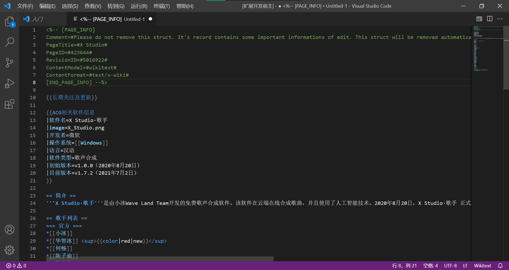
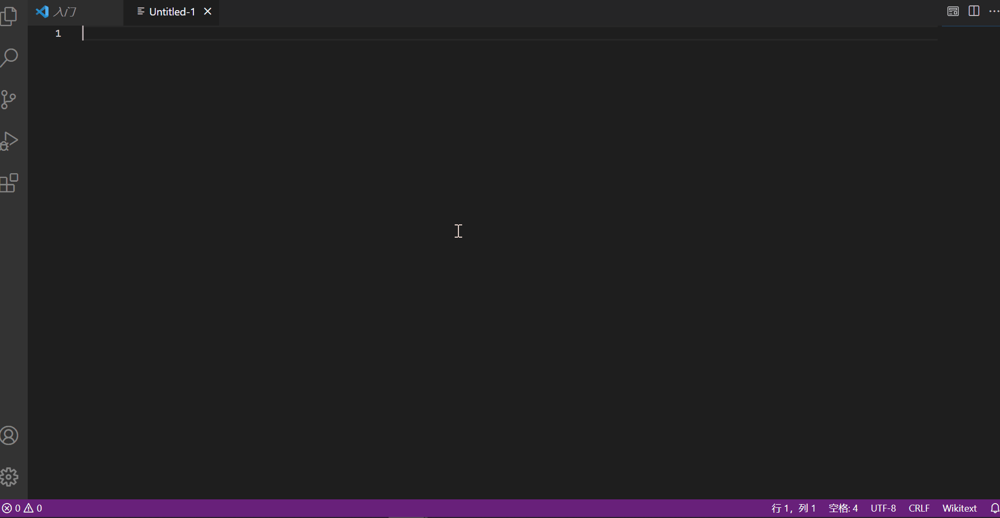
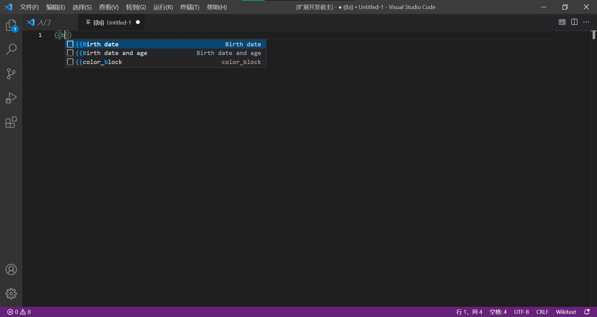

# 萌娘百科编辑助手

萌娘百科编辑助手是一款vscode插件，基于[Wikitext-VSCode-Extension](https://github.com/Frederisk/Wikitext-VSCode-Extension)。

## 特性

- 语法高亮

- 括号补全

- 模板提示（目前支持的模板较少，欢迎补充）


## 使用方法

## 开发
1. 安装[Nodejs](https://nodejs.org/) 10以上版本
2. 下载本仓库并进入目录
```
git clone https://github.com/oxygen-dioxide/moegirl-helper
cd moegirl-helper
```
3. 安装依赖项
```
npm install yarn vsce -g # VS Code Extension Manager
yarn install # Install devDependencies
```
4. 用github打开当前文件夹
```
code .
```
5. 按F5调试
